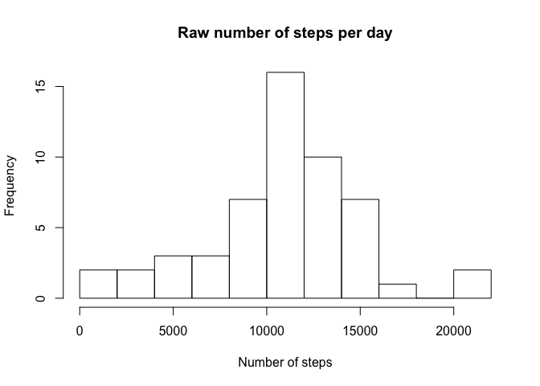
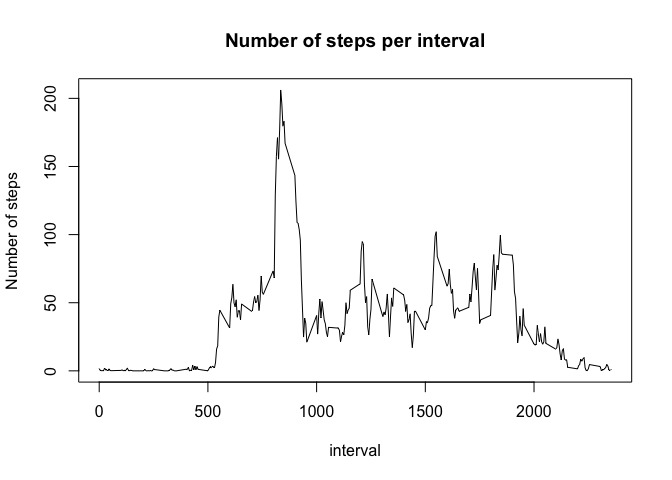
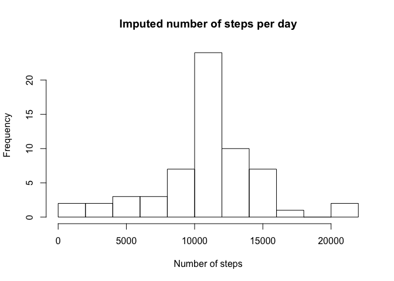
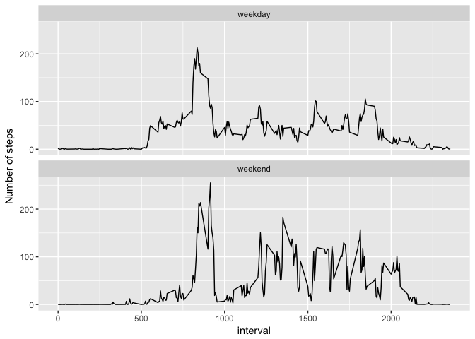

```r
library(ggplot2)
```

## Loading and preprocessing the data

```r
unzip('activity.zip')
raw <- read.csv('activity.csv', quote = '"')
raw[2]<- as.Date(raw[,2])
raw[1]<- as.integer(raw[,1])
raw[3]<- as.integer(raw[,3])
head(raw)
```

```
##   steps       date interval
## 1    NA 2012-10-01        0
## 2    NA 2012-10-01        5
## 3    NA 2012-10-01       10
## 4    NA 2012-10-01       15
## 5    NA 2012-10-01       20
## 6    NA 2012-10-01       25
```

## What is mean total number of steps taken per day?

```r
stepsPerDay.raw <- aggregate(steps~date, data = raw, FUN = sum)
hist(stepsPerDay.raw$steps, breaks = 14L, main = 'Raw number of steps per day', xlab = 'Number of steps')
```

<!-- -->

```r
mean(stepsPerDay.raw$steps, na.rm = TRUE)
```

```
## [1] 10766.19
```

```r
median(stepsPerDay.raw$steps, na.rm = TRUE)
```

```
## [1] 10765
```


## What is the average daily activity pattern?

```r
mean.by.intervals <- aggregate(steps~interval, data = raw, FUN = mean, na.rm = TRUE)
with(mean.by.intervals, plot(interval, steps, type = 'l', main = 'Number of steps per interval', ylab = 'Number of steps'))
```

<!-- -->

```r
mean.by.intervals[which.max(mean.by.intervals$steps),1] #5-min interval with max steps
```

```
## [1] 835
```

## Imputing missing values

```r
NA_positions <- !complete.cases(raw)
sum(NA_positions) #number of rows with NAs
```

```
## [1] 2304
```

```r
raw->imputed #Use mean for that 5-min interval to impute NAs
for(i in 1:length(NA_positions)){ 
  if(NA_positions[i]){
    target <- imputed[i,3]
    imputed[i,1]<-  mean.by.intervals[mean.by.intervals$interval==target,2]
  }
} 
head(imputed)
```

```
##       steps       date interval
## 1 1.7169811 2012-10-01        0
## 2 0.3396226 2012-10-01        5
## 3 0.1320755 2012-10-01       10
## 4 0.1509434 2012-10-01       15
## 5 0.0754717 2012-10-01       20
## 6 2.0943396 2012-10-01       25
```

```r
imputed_daily_steps <- aggregate(steps ~ date, data = imputed, FUN = sum)
hist(imputed_daily_steps$steps, breaks = 14L, main = 'Imputed number of steps per day', xlab = 'Number of steps')
```

<!-- -->

```r
mean(imputed_daily_steps$steps)
```

```
## [1] 10766.19
```

```r
median(imputed_daily_steps$steps)
```

```
## [1] 10766.19
```
Mean and median is almost unaffected.


## Are there differences in activity patterns between weekdays and weekends?

```r
calendar <- weekdays(imputed$date, TRUE)
weekday_end <- sapply(calendar, function(x){ifelse((x == 'SUN'|x == 'Sat'), 'weekend', 'weekday')})
print(head(weekday_end))
```

```
##       Mon       Mon       Mon       Mon       Mon       Mon 
## "weekday" "weekday" "weekday" "weekday" "weekday" "weekday"
```

```r
weekend <- subset(imputed, weekday_end == 'weekend')
weekday <- subset(imputed, weekday_end == 'weekday')
weekend.agg <- cbind(aggregate(steps~interval, FUN = mean, data = weekend), 'weekend')
weekday.agg <- cbind(aggregate(steps~interval, FUN = mean, data = weekday), 'weekday')
colnames(weekend.agg) <- colnames(weekday.agg) <- c('interval', 'steps', 'week')
forplot <- rbind(weekday.agg, weekend.agg)
ggplot(forplot, aes(interval, steps)) + geom_line() + facet_wrap(~week, nrow = 2) + ylab('Number of steps')
```

<!-- -->
